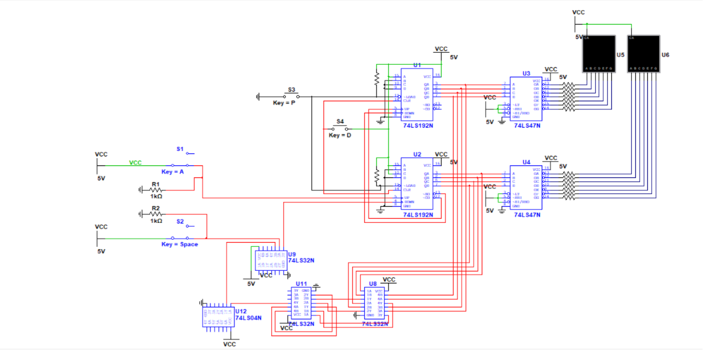
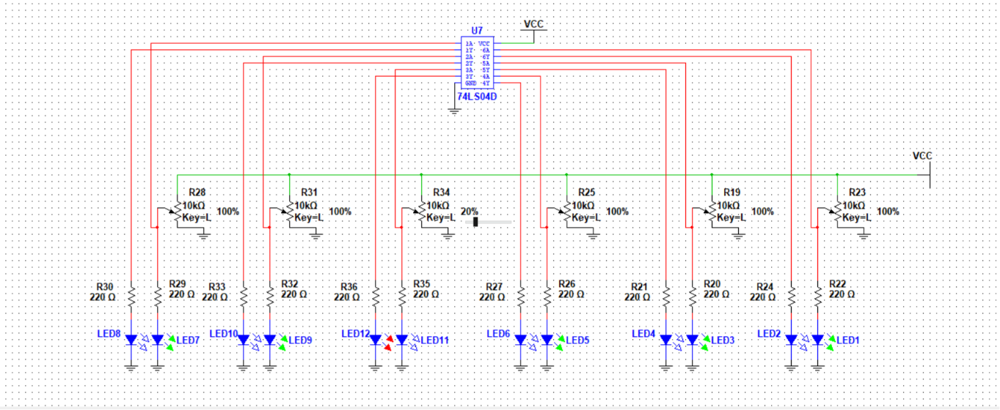

# Automated Smart Parking System (Digital Logic Design)

An automated vehicle tracking and slot monitoring system implemented on physical breadboards using 74-series digital logic gates with NI Multisim. This system achieves complete workspace automation without microcontrollers, relying entirely on combinatorial and sequential logic circuits.

## 🚀 Key Features
* **Automated Vehicle Detection:** Replaced manual switches with floor-mounted **Infrared (IR) Sensor Modules** at the gates. The system automatically detects a vehicle entering or exiting based on the sensor beam interruption.
* **Real-time Space Counting:** Dynamically tracks vehicle entry and exit to maintain an accurate count of available slots using cascading counters.
* **Underflow Prevention Gating:** Features a custom zero-detection feedback isolation loop that blocks the exit pulse when the lot is empty (`00`), preventing counter wrap-around to `99`.
* **Individual Slot Availability Status:** Implements floor-mounted Light Dependent Resistors (LDRs) to monitor physical slot occupancy. 
  * **Empty Slot:** Ambient light hits the LDR directly, driving a **Green LED** indicator.
  * **Occupied Slot:** A parked car blocks the light, triggering a **NOT gate** inverter circuit to switch off the green indicator and illuminate a **Red LED**.
  * *Note: For simulation stability inside NI Multisim, potentiometers are utilized to mimic the changing resistance profiles of the LDR sensors.*

## 🛠️ Hardware & Components Used
* **Infrared (IR) Sensor Modules:** For non-contact automated entry/exit detection
* **74LS192N:** Synchronous 4-Bit Up/Down Counters
* **74LS47N:** BCD-to-7-Segment Decoders/Drivers
* **74LS32:** Quad 2-Input OR Gates (utilized for active-low signal gating)
* **74LS08 / 74LS04:** AND Gates and Hex Inverters for state detection and LED switching
* **LDR / Potentiometer Network** for physical floor sensing
* **Common Anode 7-Segment Displays** & Status LEDs
* **Pull-Up/Pull-Down Resistors ($1\text{ k}\Omega$)** for line stabilization

---

## 📊 Project Visuals

### Circuit Schematic (NI Multisim Layouts)
Below is the complete architectural layout verified inside the simulation environment:

  
  

### Physical Hardware Implementation
Here is the functional physical prototype assembled and mapped out on the breadboards:

  
  

---

## 🧠 Logic Breakdown: Underflow Lock-up Fix
A common issue with the `74LS192` counter in active-low setups is that when the decrement input triggers at `00`, a borrow pulse forces the system to wrap around to `99` and enter an unstable state loop.

To resolve this, this architecture implements **pre-emptive signal gating**:
1. The binary outputs ($QA, QB, QC, QD$) of both the Units and Tens counters are continuously monitored.
2. When absolute zero (`00`) is detected, a dedicated logic network generates a **HIGH (`1`) Empty Signal**.
3. This signal is fed into a `74LS32` OR gate alongside the active-low signal line from the Exit IR Sensor module. 
4. At `00`, the OR gate forces the counter's `DOWN` clock pin to remain permanently **HIGH**, successfully blocking any falling-edge ($1 \rightarrow 0$) trigger from the sensor. The pulse is safely discarded before an underflow can execute, preventing system paralysis.

## 💻 How to Run the Simulation
1. Clone this repository or download the files.
2. Open **National Instruments Multisim (v14.0 or higher)**.
3. Load the simulation file.
4. Click the **Run** interactive simulation switch to test entry/exit pulses and adjust the potentiometer sliders to simulate cars blocking the LDR sensors.
